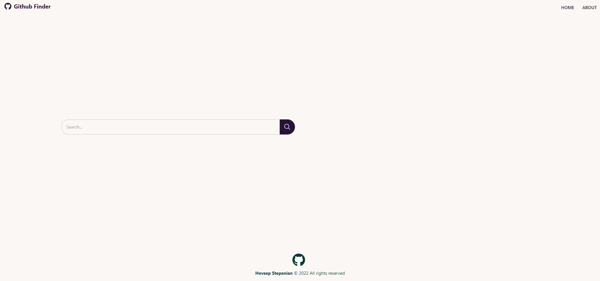
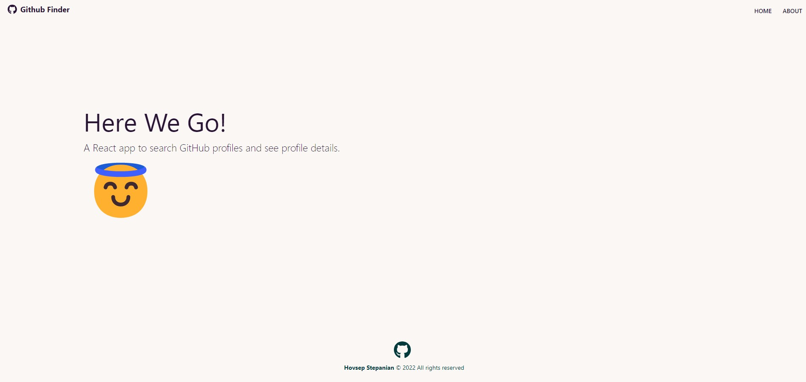
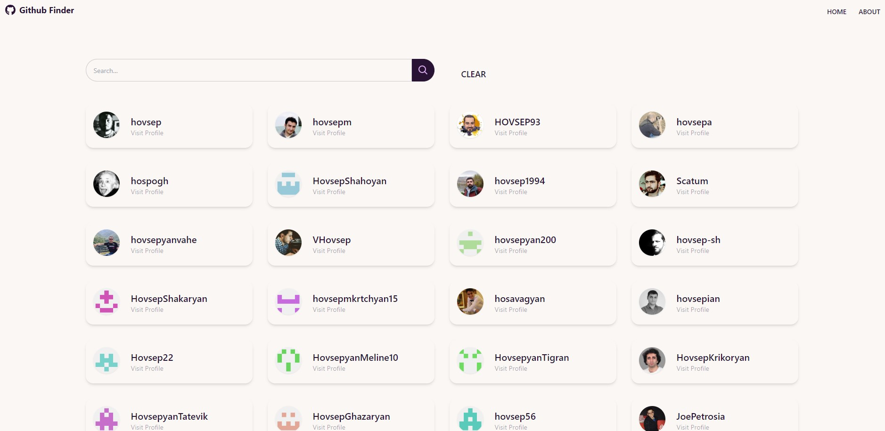
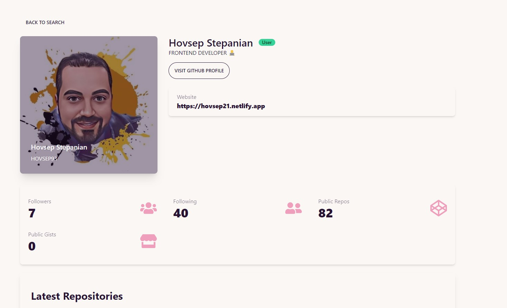
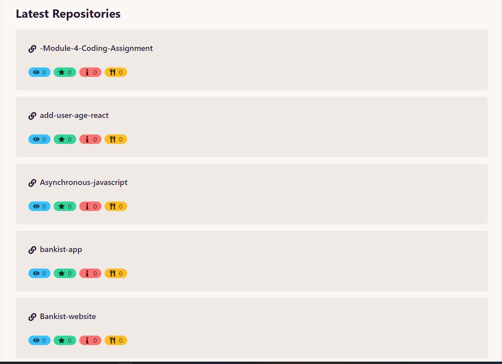

<h1 style="text-align: "center"; style="font-weight: bold;">Github Finder App H21 </h1>

App to search Github users and display their info. This is part of my React Front To Back 2022 course and is the most up to date version of this project.

## DEMO:
https://github-finder-h21.vercel.app/

## Udemy Course :

React Front To Back 2022
Learn modern React by building 4 projects including a Firebase 9 app and a full stack MERN app 

                                                                    

<a href="https://www.udemy.com/course/react-front-to-back-2022/">Brad Traversy</a>   

<h1>introduction</h1>

                                       

  <h2>technology i use here:</h2>

React js

 Tailwind CSS v3.1.4

